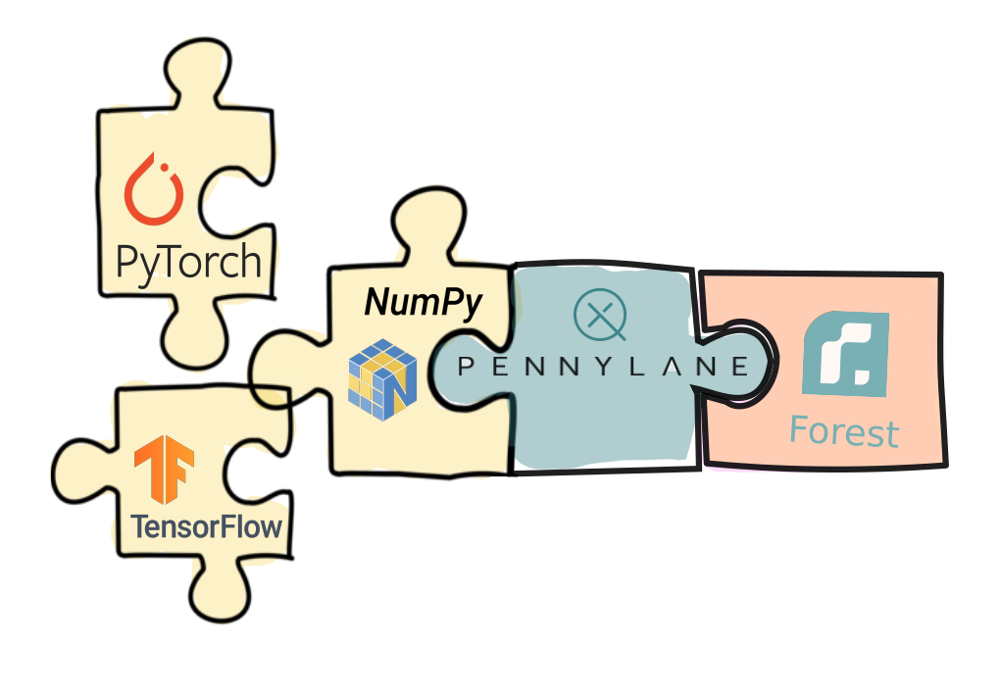

PennyLane-Forest Plugin
#######################

:Release: |release|

|

.. include:: ../README.rst
  :start-after:	header-start-inclusion-marker-do-not-remove
  :end-before: header-end-inclusion-marker-do-not-remove

Once Pennylane-Forest is installed, the provided Forest devices can be accessed straight
away in PennyLane, without the need to import any additional packages.

Devices
~~~~~~~
Currently, PennyLane-Forest provides these Forest devices for PennyLane:

.. devicegalleryitem::
    :name: 'forest.numpy_wavefunction'
    :description: Forest's Numpy wavefunction simulator backend.
    :link: devices/numpy_wavefunction.html

.. devicegalleryitem::
    :name: 'forest.wavefunction'
    :description: The Forest SDK wavefunction simulator backend.
    :link: devices/wavefunction.html

.. devicegalleryitem::
    :name: 'forest.qvm'
    :description: Forest's QVM and pyQuil pyQVM simulator.
    :link: devices/qvm.html

.. raw:: html

        

         

Tutorials
~~~~~~~~~

Check out these demos to see the PennyLane-Forest plugin in action:

.. raw:: html

    

.. demogalleryitem::
    :name: Ensemble classification with Forest and Qiskit devices
    :figure: https://pennylane.ai/qml/_images/ensemble_diagram.png
    :link:  https://pennylane.ai/qml/demos/tutorial_ensemble_multi_qpu.html
    :tooltip: Use multiple QPUs to improve classification.

.. demogalleryitem::
    :name: PyTorch and noisy devices
    :figure: https://pennylane.ai/qml/_images/bloch.gif
    :link:  https://pennylane.ai/qml/demos/pytorch_noise.html
    :tooltip: Extend PyTorch with real quantum computing power.

.. raw:: html

    

  

You can also try it out using any of the qubit based `demos from the PennyLane documentation
<https://pennylane.ai/qml/demonstrations.html>`_, for example the tutorial on
`qubit rotation <https://pennylane.ai/qml/demos/tutorial_qubit_rotation.html>`_.
Simply replace ``'default.qubit'`` with a ``'forest.XXX'`` device if you have an API key for
hardware access.

.. code-block:: python

    dev = qml.device('forest.XXX', wires=XXX)

.. raw:: html

     

.. toctree::
   :maxdepth: 2
   :titlesonly:
   :hidden:

   installation
   support

.. toctree::
   :maxdepth: 2
   :caption: Usage
   :hidden:

   devices/numpy_wavefunction
   devices/wavefunction
   devices/qvm

.. toctree::
   :maxdepth: 1
   :caption: API
   :hidden:

   code
